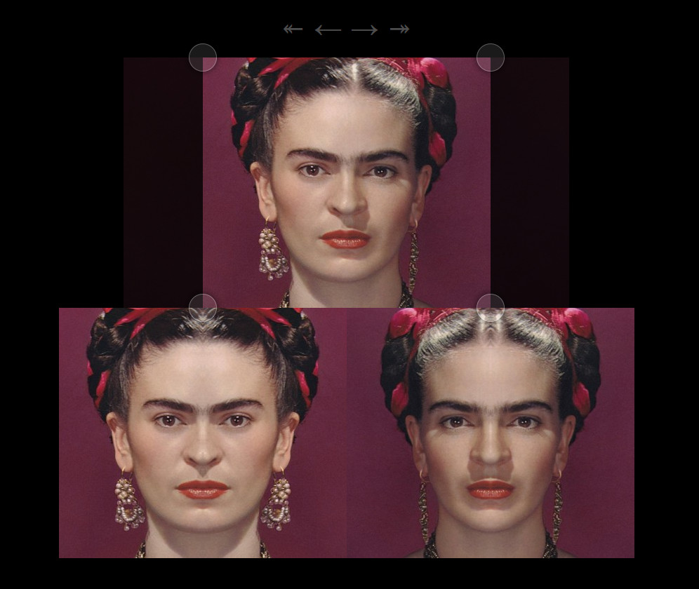

# mirror-twin-gro

> play with image
> [bilateral symmetry](https://en.wikipedia.org/wiki/Symmetry_in_biology#Bilateral_symmetry),
> with a focus on faces 😑
> [ryanatkn.github.io/mirror-twin-gro](https://ryanatkn.github.io/mirror-twin-gro)

this is a little one page web app with two implementations:

| 🐢                                                                                     | tech                                                                                  | 🕸️                                                                                                       |
| -------------------------------------------------------------------------------------- | ------------------------------------------------------------------------------------- | -------------------------------------------------------------------------------------------------------- |
| [`mirror-twin-sveltekit-vite`](https://github.com/ryanatkn/mirror-twin-sveltekit-vite) | [SvelteKit](https://github.com/sveltejs/kit) ∙ [Vite](https://github.com/vitejs/vite) | [`ryanatkn.github.io/mirror-twin-sveltekit-vite`](https://ryanatkn.github.io/mirror-twin-sveltekit-vite) |
| `mirror-twin-gro`                                                                      | [Gro](https://github.com/feltcoop/gro)                                                | [ `ryanatkn.github.io/mirror-twin-gro`](https://ryanatkn.github.io/mirror-twin-gro)                      |

# :turtle::turtle::turtle:

both build on [Svelte](https://github.com/sveltejs/svelte) ∙
[Rollup](https://github.com/rollup/rollup) ∙
[esbuild](https://github.com/evanw/esbuild)

## todo

- import from a shared library
- there's a 1px black line rendering bug I failed many times to fix -
  I think the numbers are correct but it's tricky because DOM -
  I'll probably change to canvas and hopefully avoid the mess
- add some cool features, like better persistence, better image importing, and exporting

## images

- [ada_lovelace.png](/src/images/ada_lovelace.png) -
  <https://commons.wikimedia.org/wiki/File:Ada_Byron_daguerreotype_by_Antoine_Claudet_1843_or_1850_-_cropped.png>
- [alan_turing.jpg](/src/images/alan_turing.jpg) -
  <https://commons.wikimedia.org/wiki/File:Code_breaker_-_Alan_Turing%27s_Life_and_Legacy_at_London_Science_Museum_(Ank_Kumar)_03.jpg>
- [frida_kahlo.jpg](/src/images/frida_kahlo.jpg) -
  <https://commons.wikimedia.org/wiki/File:Mostra_di_Frida_Kahlo_al_Mudec_di_Milano_3_maggio_2018_(12).jpg>

## license 🐦

public domain ([The Unlicense](license))

see software & image credits above

made with the help of infinite turtles
